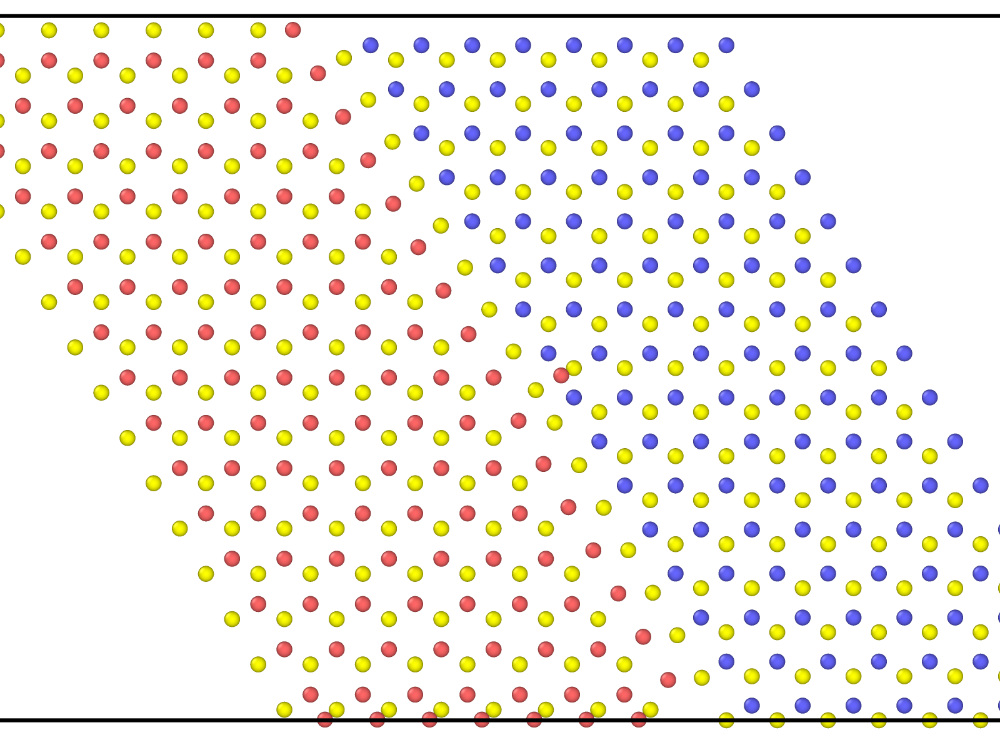
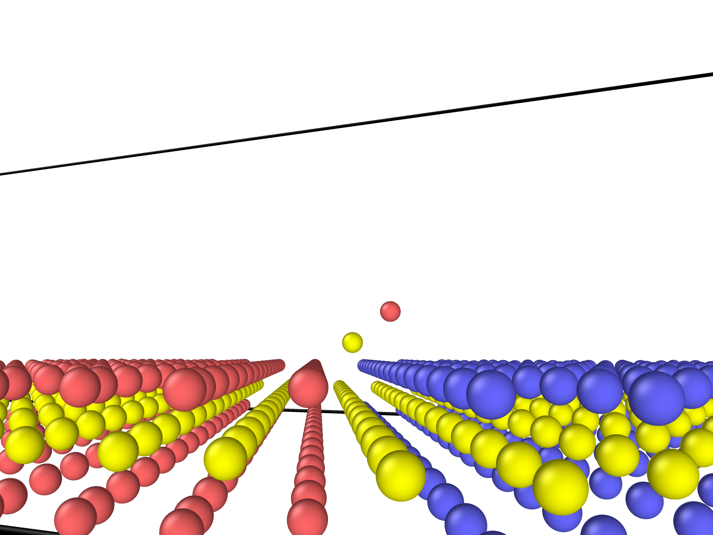

# WS2-WSe2 介面位错迁移引导 WS2 生长模拟

## 模拟设置总结

### 1. **核心目标**

- 在 WS2/WSe2 界面模拟5|7位错（五元环+七元环）的迁移行为
- 保持二维材料的层状结构和六方晶格稳定性
- 使用较低温度（最高550K）防止结构崩溃

#### 2. **关键参数设置**

| 参数         | 值                                 | 说明                                       |
| ------------ | ---------------------------------- | ------------------------------------------ |
| **温度**     | W: 200-550K<br>Se: 450K<br>S: 550K | 低于实验温度(850℃/1123K), 但能维持体系稳定 |
| **时间步长** | 0.1 fs                             | 满足 ReaxFF 对时间步长的要求               |
| **基底约束** | LJ9/3势<br>ε=0.1 eV, σ=2.3Å        | 模拟蓝宝石基底                             |
| **力场**     | ReaxFF (ffield.reax.wses)          | 替代论文中的REBO力场                       |

#### 3. **模拟流程**

1. **初始化**

   - 读取包含5|7位错的初始结构 (`ws2_wse2_57_disloc_single.lmp`)
   - 原子分组：W/Se/S
   - 基底约束：`fix substrate all wall/lj93`

2. **弛豫阶段**

   - NPT系综 (300K, 5000 步)
   - 共轭梯度最小化

3. **加热阶段**

   - 分层控温：
     - 顶层原子：200K
     - 底层原子：100K
   - 20000 步

4. **高温弛豫**

   - NVE系综 (无温度控制)

5. **冷却阶段**
   - 从200K→100K (5000 步)
   - 100K 保持 5000 步

#### 4. **模型构建关键点 (Python脚本)**

1. **晶格适配**

   - WS₂晶格常数：3.19Å
   - WSe₂晶格常数：3.282Å

2. **位错引入**

   - 通过原子位移创建5|7位错核心
   - 非均匀位移实现应变梯度：

3. **界面构建**
   - WS₂和WSe₂层偏移连接：
   ```python
   ws2.positions[:] += translation_vec_by_a_wse2 * 0.7
   wse2.positions[:,0] += ws2.cell[0,0] + 1.1
   ```
   
   

#### 5. **稳定性维持策略**

1. **温度控制**

   - 最高温度200K (远低于实验1123K)
   - 分层控温保护界面结构

2. **原子删除机制**

   - 移除z方向位移>3.5Å的原子

   ```lammps
   variable W_out_condition atom "abs(z - v_W_plane_height) > 3.5"
   delete_atoms group W_out_of_plane_atoms
   ```

3. **基底约束**
   - LJ9/3势模拟刚性基底
   ```lammps
   fix substrate all wall/lj93 zlo EDGE 0.1 2.3 6.5
   ```

#### 6. **输出与监控**

- **热力学输出**
  ```lammps
  thermo 100
  thermo_style custom step temp pe etotal
  ```
- **轨迹输出**
  ```lammps
  dump anneal all custom 100 dumpfile id type x y z
  ```

### 模拟方案总结

1. **保守的温度策略**：牺牲高温动力学准确性，换取结构稳定性
2. **ReaxFF力场妥协**：因缺乏REBO参数，使用由期刊发表的 WS2 与 WSe2 的ReaxFF反应力场文件，但由于没有找到含有 S 和 Se 相互作用参数的 ReaxFF 力场，我们仅能近似猜测其参数来进行 lammps 的相关模拟计算
3. **结构保护机制**：基底约束防止崩溃
4. **精细时间步长**：0.1fs处理键合变化

## 模拟结果总结

1. 进行了多次的 nve, npt, nvt 系综的排列组合计算尝试后，我们发现 nvt 和 nve 能有效诱导于位错中心上方加入的 WS 原子向 WSe2 矩阵迁移。而 npt 仅能大幅度改变模拟体系维度大小，拉扯 WS2 和 WSe2 矩阵，但对加入的 WS 原子没有显著的诱导作用，无法观察到迁移
2. 在初期的 npt 弛豫后，体系进入 nvt 和 nve 系综，可以观察到位错中心上方加入的 WS 原子有明显的向 WSe2 矩阵迁移的行为，同时可以观察到 S 原子正试图取代原来 Se 原子的位置。尽管单次 MD 模拟中难以直观模拟实验中高温环境下的 S 或 Se 原子升华离开表面体系的断键与离去过程，我们可从目前结果推测，向 5|7 位错中心加入新的 WS2 分子，会引导它们取代 WSe2 矩阵测的 Se 原子，实现方向性的延伸生长。
